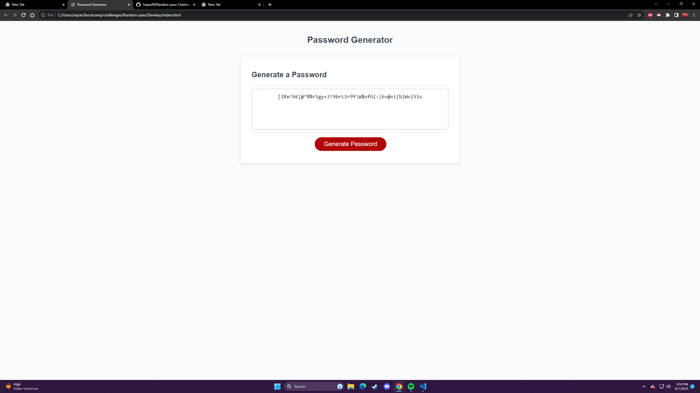

# Random-pass

# Description: Created radom passowrd generator for class Challenge. Goal was to generate a random password according to the users liking for example, how many characters ? if lowercase, if uppercase, if numbers, and special characters.

# Webpage:

# Website
https://sepan09.github.io/Random-pass/
